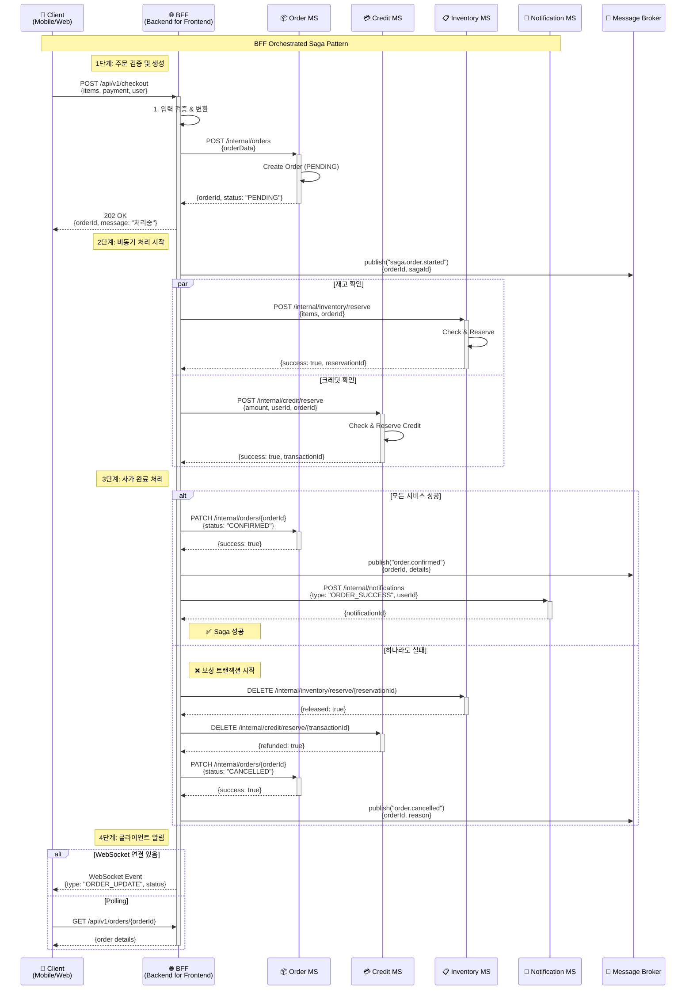
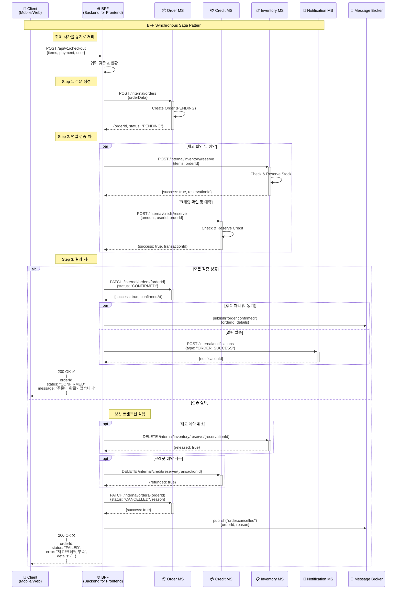

# 분산 환경에서도 안전하게 데이터를 처리하는 방법

실패는 정상적인 실패와 비정상적인 실패로 나눌 수 있습니다.

- 정상적인 실패: Business Exception (ex. 재고 부족, 한도 초과 등)
- 비정상적인 실패: System Exception (ex. DB 연결 실패, 네트워크 장애 등)

## 1. 분산 트랜잭션(Distributed Transaction)

물리적으로 서로 다른 위치에 있는 여러 서버들이 네트워크를 통해 연결되어 하나의 시스템처럼 동작하는 것을 분산 환경이라고 합니다.
어떤 비즈니스 플로우(flow)는 분산 환경에서 네트워크를 통해 연결된 서비스들을 두루 걸쳐 실행됩니다. 이를 분산 트랜잭션이라고 합니다. 분산 트랜잭션에 참여한 각 서비스들은 각자 로컬 트랜잭션을 수행합니다. 비즈니스 관점에서 바라보았을 때 분산 트랜잭션에 참여한 서비스들이 수행한 로컬 트랜잭션들은 의미 있는 연관 관계를 가집니다.

### 1.1 분산 트랜잭션의 어려움

마이크로서비스 아키텍처(MSA, MicroService Architecture)는 대표적인 분산 트랜잭션 환경입니다. `MSA`가 아니더라도 외부 시스템이랑 소통하는 상황이라면 분산 트랜잭션 환경이라고 볼 수 있습니다.

- 마이크로서비스는 자신이 오너십(ownership)을 가지는 데이터 테이블들을 별도의 데이터베이스에 관리합니다.
- 데이터베이스 크기, 유형, 스키마 등을 서비스에 맞게 조절할 수 있습니다.
- 다른 서비스에서 발생하는 오류나 장애로부터 데이터를 지킬 수 있습니다.
- 서비스 별로 캡슐화된 데이터를 가지기 때문에 서비스 간 결합도가 낮습니다.

마이크로서비스는 각자 데이터베이스를 소유하기 때문에 ACID 특성을 가진 로컬 트랜잭션 처리가 가능합니다.
하지만 분산 트랜잭션은 서비스 사이를 넘나들면서 로컬 트랜잭션들을 발생시킵니다. 각자 다른 서비스, 다른 데이터베이스에서 데이터를 처리하기 때문에 트랜잭션의 ACID 특성을 지키기 어렵습니다. 거시적인 관점에서 시스템을 바라보았을 때 시스템 전체의 데이터 일관성을 모노리스 아키텍처처럼 데이터베이스만으로 지키기 어려워졌습니다.

예를 들면 다음과 같은 상황을 생각할 수 있습니다. 시스템에 주문(order) 서비스와 크레딧(credit) 서비스가 존재한다고 가정하였습니다.

1. 사용자는 물건 구매를 위해 주문을 생성합니다.
2. 사용자 요청을 전달받은 주문 서비스는 주문 생성을 완료합니다.
3. 주문 서비스는 크레딧 서비스에게 결제된 금액만큼 크레딧 차감하도록 이벤트를 전달합니다.
4. 이벤트를 전달받은 크레딧 서비스는 주문이 완료된 금액만큼 크레딧에서 차감을 시도합니다.
5. 크레딧 서비스에서 로직 중간에 에러가 발생하면서 차감된 크레딧 정보는 롤백(rollback)되어 이전 상태로 돌아갑니다.
6. 주문 서비스에서 생성한 주문은 커밋된 상태이고 별도 처리가 없었으므로 그대로 유지됩니다.
7. 전체 시스템 관점에서 보았을 때 구매자는 크레딧 차감 없이 정상적인 주문이 생성되었으므로 문제가 발생합니다.

## 2. 사가 패턴(Saga Pattern)

`MSA` 환경에서는 트랜잭션의 관리 주체는 데이터베이스가 아닌 애플리케이션입니다.
사가 패턴(saga pattern)은 분산 트랜잭션 환경에서 강력한 데이터 일관성을 지키지 못하는 한계를 인정하고 최종적인 일관성(eventual consistency)을 보장하기 위한 방법입니다.

사가 패턴은 비즈니스 흐름을 따라 서비스들의 로컬 트랜잭션을 순차적으로 처리합니다. 다음과 같은 과정을 통해 사가 패턴을 적용합니다.

1. 전체적인 비즈니스 프로세스를 살펴보고 각 서비스의 로컬 트랜잭션으로 처리할 수 있도록 작업 단위를 나누고 순서를 결정.
    - 예를 들어 주문을 생성하는 프로세스는 주문을 생성하고, 사용자 크레딧을 차감한 후 배송을 시작.
    - 주문 서비스에서 주문을 생성하는 로컬 트랜잭션 수행이 필요.
    - 크레딧 서비스에서 크레딧을 차감하는 로컬 트랜잭션 수행이 필요.
    - 배송 서비스는 배송 시작 정보를 생성하는 로컬 트랜잭션 수행이 필요.

2. 선행되어야 하는 서비스부터 로컬 트랜잭션을 처리.

3. 로컬 트랜잭션을 마친 서비스는 다음 트랜잭션이 수행되도록 트리거(trigger).
    - 트리거 방법은 이벤트 발행, 메시지 큐 전송, REST API 호출 등 다양.

4. 비즈니스 프로세스를 따라 각 서비스들에서 로컬 트랜잭션이 실행.

### 2.1. 보상 트랜잭션(Compensating Transaction) 정의

사가 패턴을 적용하기 위해선 보상 트랜잭션을 고려해야 합니다.
각 서비스는 로컬 트랜잭션을 커밋하기 때문에 다음 서비스가 실패할 경우 자신의 상태를 이전으로 되돌려야 합니다.
로컬 트랜잭션이 끝났으므로 롤백(rollback)은 불가하지만, 비즈니스적인 의미에서 이전 상태로 되돌립니다(undo).
개발자는 보상 트랜잭션을 위한 고려 사항들을 설계에 반영하고 별도 로직을 구현해야 합니다.

다음과 같은 상황을 예시로 보상 트랜잭션에 대해 알아보겠습니다.

1. 주문 서비스는 주문을 생성.
   - 주문의 상태는 `Pending` 상태.
2. 주문 서비스는 다음 서비스를 트리거.
3. 크레딧 서비스는 크레딧 차감하는 중에 에러 발생.
   - 크레딧 이전으로 롤백.
4. 크레딧 서비스는 자신의 실패를 알리는 `보상 트랜잭션`을 수행.
   - 이벤트나 HTTP API를 통해 주문 서비스에게 자신의 실패를 알림.
5. 보상 트랜잭션에 의해 주문 서비스는 주문의 상태를 `Cancelled` 상태로 변경.
6. 만약 정상적으로 수행되었다면 주문 상태를 `Completed` 상태로 변경.

### 2.2. 오케스트레이션 사가

음악 무대의 오케스트레이터(orchestrator)처럼 전체적인 트랜잭션을 조율하는 컴포넌트가 존재합니다. 어떤 경우엔 중앙 오케스트레이터 역할의 서비스를 만들기도 하지만, 크리스 리차든의 구현 방법을 위주로 설명을 이어가겠습니다.

해당 비즈니스를 처리하기 위한 사가 컴포넌트가 전체 트랜잭션을 컨트롤합니다. 사가 컴포넌트는 자신이 책임지고 있는 로직을 수행하고 다음 참가자에게 메시지를 전달합니다. 다른 사가 패턴 참가자의 메시지 응답에 따라 필요한 다음 처리를 선택적으로 수행합니다. 사가 패턴에 참여하는 서비스들은 다른 참가자들을 알 필요가 없습니다.

주문 정보를 만드는 프로세스를 예시로 오케스트레이션 사가 패턴의 전반적인 동작 과정을 살펴보겠습니다.

1. 주문 서비스가 주문 생성 요청을 받음.
2. 주문 사가 컴포넌트가 주문을 생성
3. 주문 사가 컴포넌트는 메시지 브로커를 통해 크레딧 생성 요청 메시지 발행.
   - 주문이 생성되었음을 클라이언트에게 응답.
4. 크레딧 서비스의 커멘트 핸들러가 메시지를 받아 크레딧 추가 예약을 요청.
5. 크레딧 서비스는 주문한 금액만큼 크레딧을 제공.
6. 크레딧 서비스는 예약 성공 여부를 메시지로 전달.
7. 주문 사가 컴포넌트는 크레딧 성공 여부에 따라 생성한 주문을 확정하거나 취소.

#### 2.2.1. 오케스트레이션 사가 패턴 시퀀스 다이어그램 (Case. 202)

#### 2.2.2. 오케스트레이션 사가 패턴 시퀀스 다이어그램 (Case. 200)

- <https://youtu.be/YPbGW3Fnmbc?si=SEJA5SkVSXQ8Bjd>_
- <https://microservices.io/patterns/data/saga.html>
- <https://junhyunny.github.io/msa/design-pattern/distributed-transaction/>
- <https://youtu.be/uk5fRLUsBfk?si=p_fxSEg1fAUff0pe>
