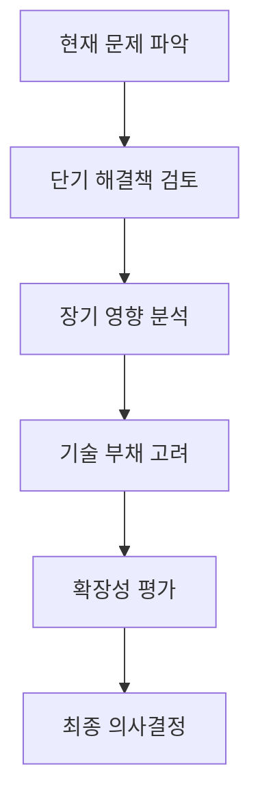

# 테크 리더십의 핵심 원칙: 개발자에서 리더로

개발자로서 커리어를 시작해 테크 리더 역할까지 성장하면서, 코드를 잘 짜는 것과 팀을 이끄는 것은 완전히 다른 스킬셋임을 깨달았습니다. 실무에서 경험한 테크 리더십의 핵심 원칙들을 공유해보겠습니다.

## 1. 기술적 비전과 전략적 사고

### 장기적 관점에서 기술 결정하기
단순히 현재의 문제를 해결하는 것을 넘어, 3-5년 후의 기술 환경과 비즈니스 요구사항을 고려한 의사결정이 필요합니다.



### 기술 선택의 기준
- **비즈니스 가치**: 기술이 비즈니스 목표에 얼마나 기여하는가?
- **팀 역량**: 현재 팀이 해당 기술을 효과적으로 활용할 수 있는가?
- **유지보수성**: 장기적으로 지속 가능한 선택인가?
- **생태계**: 커뮤니티 지원과 라이브러리 생태계는 충분한가?

## 2. 효과적인 커뮤니케이션

### 다양한 이해관계자와의 소통
테크 리더는 개발자, PM, 디자이너, 경영진 등 다양한 배경을 가진 사람들과 소통해야 합니다.

```javascript
// 비개발자를 위한 기술 설명 예시
const explainTechnicalConcept = (audience, concept) => {
  const explanations = {
    'executive': {
      'microservices': '서비스를 작은 단위로 나누어 개발 속도를 높이고 장애 영향을 최소화하는 아키텍처',
      'technical_debt': '빠른 개발을 위해 임시로 구현한 코드로 인해 발생하는 미래 개발 비용'
    },
    'product_manager': {
      'api_rate_limiting': '서버 부하를 방지하기 위해 API 호출 횟수를 제한하는 기능',
      'cache': '자주 사용되는 데이터를 빠르게 접근할 수 있도록 임시 저장하는 기술'
    }
  };
  
  return explanations[audience]?.[concept] || '기술적 세부사항 설명이 필요합니다.';
};
```

### 투명한 의사결정 과정
기술적 결정을 내릴 때는 그 이유와 과정을 투명하게 공유합니다.

```markdown
## 기술 선택 문서 템플릿

### 문제 정의
- 현재 상황
- 해결해야 할 문제
- 성공 기준

### 고려한 대안들
1. 옵션 A: 장점 / 단점 / 비용
2. 옵션 B: 장점 / 단점 / 비용
3. 옵션 C: 장점 / 단점 / 비용

### 최종 결정
- 선택한 옵션과 이유
- 예상되는 리스크와 대응 방안
- 구현 일정과 마일스톤
```

## 3. 팀 성장과 개발

### 개별 팀원의 성장 지원
각 팀원의 강점과 성장 목표를 파악하고, 적절한 기회를 제공하는 것이 중요합니다.

```typescript
interface TeamMember {
  name: string;
  currentSkills: string[];
  growthGoals: string[];
  preferredLearningStyle: 'hands-on' | 'mentoring' | 'self-study';
  careerAspirations: string;
}

class TeamGrowthManager {
  assignProject(member: TeamMember, projects: Project[]): Project {
    // 성장 목표와 프로젝트 요구사항을 매칭
    return projects.find(project => 
      project.requiredSkills.some(skill => 
        member.growthGoals.includes(skill)
      )
    );
  }
  
  provideFeedback(member: TeamMember, performance: Performance): Feedback {
    return {
      strengths: performance.highlights,
      improvementAreas: performance.challenges,
      actionItems: this.generateActionItems(member, performance),
      resources: this.recommendResources(member.growthGoals)
    };
  }
}
```

### 심리적 안전감 조성
팀원들이 실수를 두려워하지 않고 도전할 수 있는 환경을 만드는 것이 혁신의 기반입니다.

- **실패를 학습 기회로**: "왜 실패했는지" 보다 "무엇을 배웠는지"에 집중
- **질문하는 문화**: 모르는 것을 부끄러워하지 않는 분위기 조성
- **실험 장려**: 작은 규모의 실험과 프로토타이핑을 적극 지원

## 4. 기술 문화와 프로세스

### 코드 리뷰 문화 구축
단순한 버그 찾기를 넘어 지식 공유와 품질 향상의 기회로 활용합니다.

### 지속적 학습 환경
- **테크톡 세션**: 팀원들이 돌아가며 새로운 기술 공유
- **스터디 그룹**: 관심 분야별 자율적 학습 모임 지원
- **컨퍼런스 참석**: 외부 인사이트 습득 기회 제공

## 5. 위기 상황에서의 리더십

### 장애 대응 리더십
시스템 장애나 프로젝트 위기 상황에서는 다음 원칙을 따릅니다:

1. **신속한 현황 파악**: 감정보다는 팩트에 기반한 판단
2. **명확한 역할 분담**: 누가 무엇을 할지 분명히 지시
3. **투명한 커뮤니케이션**: 이해관계자들에게 정기적 업데이트
4. **사후 회고**: 시스템과 프로세스 개선점 도출

```python
# 장애 대응 체크리스트
class IncidentResponse:
    def handle_incident(self, incident):
        # 1단계: 즉시 대응
        self.assess_severity(incident)
        self.notify_stakeholders(incident.severity)
        self.assign_incident_commander()
        
        # 2단계: 복구 작업
        self.implement_hotfix()
        self.monitor_system_health()
        
        # 3단계: 사후 분석
        self.conduct_postmortem()
        self.update_runbooks()
        self.improve_monitoring()
```

## 실무 적용을 위한 조언

1. **점진적 변화**: 모든 것을 한 번에 바꾸려 하지 말고 작은 개선부터 시작
2. **일관성 유지**: 원칙을 정했으면 꾸준히 적용하고 모범을 보이기
3. **피드백 수용**: 팀원들의 의견을 적극적으로 듣고 반영
4. **지속적 학습**: 리더십 스킬도 기술 스킬처럼 지속적으로 개발해야 함

테크 리더십은 완벽한 정답이 없는 여정입니다. 매 순간 최선의 판단을 내리고, 실수에서 배우며, 팀과 함께 성장해 나가는 것이 핵심입니다. 가장 중요한 것은 팀원들이 성장하고 성취감을 느낄 수 있도록 돕는 것임을 항상 기억해야 합니다.